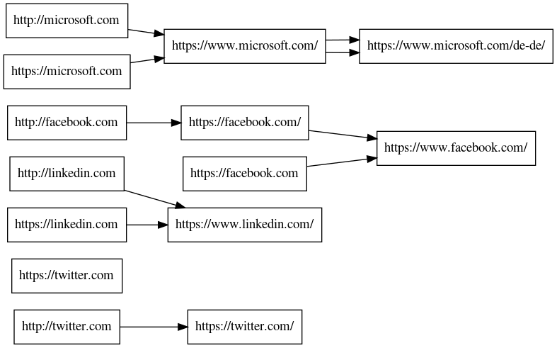

# callgraph.sh
Create graphviz file from domain redirects.

## Usage

```
$ cat domains.lst | ./callgraph.sh 
digraph G {
rankdir=LR;
node [shape=box];

"http://twitter.com" -> "https://twitter.com/";
"https://twitter.com/";
"https://twitter.com";
"http://linkedin.com" -> "https://www.linkedin.com/";
"https://www.linkedin.com/";
"https://linkedin.com" -> "https://www.linkedin.com/";
"https://www.linkedin.com/";
"http://facebook.com" -> "https://facebook.com/";
"https://facebook.com/" -> "https://www.facebook.com/";
"https://www.facebook.com/";
"https://facebook.com" -> "https://www.facebook.com/";
"https://www.facebook.com/";
"http://microsoft.com" -> "https://www.microsoft.com/";
"https://www.microsoft.com/" -> "https://www.microsoft.com/de-de/";
"https://www.microsoft.com/de-de/";
"https://microsoft.com" -> "https://www.microsoft.com/";
"https://www.microsoft.com/" -> "https://www.microsoft.com/de-de/";
"https://www.microsoft.com/de-de/";
}
```

```
# Combine with other tools like assetfinder
$ assetfinder microsoft.com | grep microsoft.com | ./callgraph.sh > graph.gv
$ dot -Tpng graph.gv -o graph.png

```

```
# Create graph with graphviz
cat domains.lst | ./callgraph.sh | dot -Tpng -o graph.png
```


